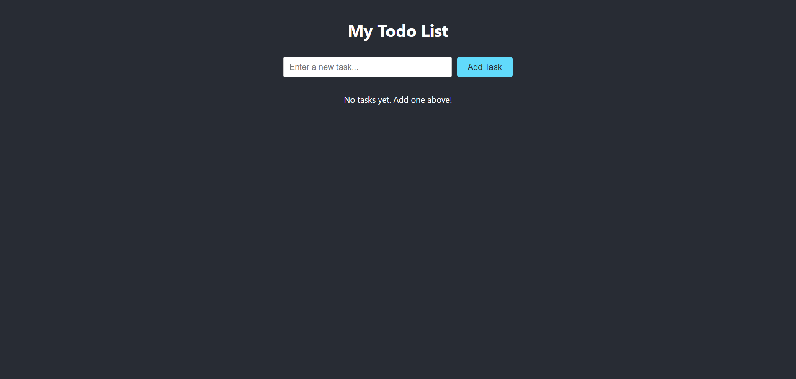
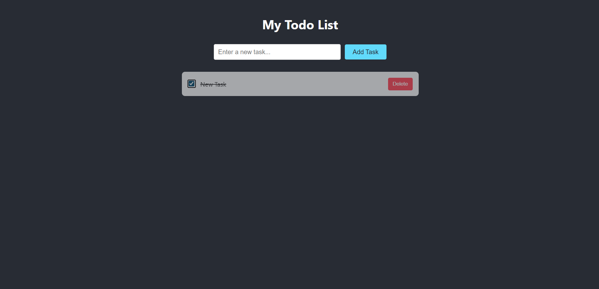
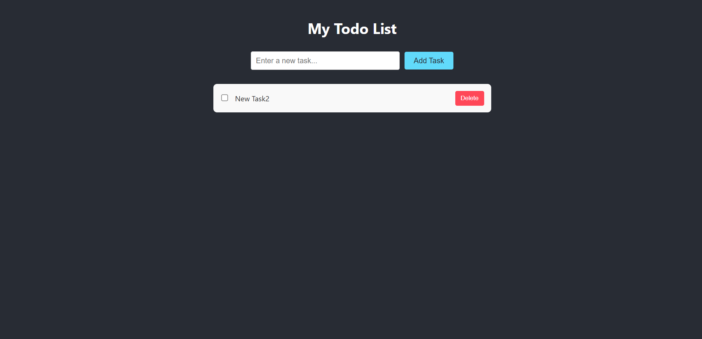

# 📝 ToDoList Application

A **full‑stack ToDo List app** built with **React ⚛️, Spring Boot 🍃, PostgreSQL 💾** and containerized with **Docker 🐳**.  
It allows users to create, update, and manage tasks. OAuth login/registration may be added in the future.  

---

## ⚙️ Tech Stack

- **Frontend:** React (JavaScript), styled with CSS  
- **Backend:** Java (Spring Boot, REST API)  
- **Database:** PostgreSQL  
- **Containerization:** Docker + Docker Compose  
- **Build Tools:** Maven (backend), npm (frontend)  

---

## 📂 Project Structure

```
ToDoList/
├── back-and/ToDoListPractice   # Spring Boot backend
│   ├── src/...
│   ├── pom.xml
│   └── Dockerfile
├── front-end                   # React frontend
│   ├── src/...
│   ├── package.json
│   └── Dockerfile
├── docker-compose.yml           # Orchestration
└── README.md
```

---

## 📸 Screenshots

### 📋 Task List View


### ➕ Add Task 


### ☑️ Completed Task 


### ✖️ Deleted Task 


---

## 🚀 Getting Started

### Prerequisites
- Docker & Docker Compose installed  
- (Optional) Java 17 and Node.js 18+ if building locally without Docker  

### 1. Clone the Repository
```bash
git clone https://github.com/AISokolov/ToDoList.git
cd ToDoList
```

### 2. Start with Docker
```bash
docker-compose up --build
```

This will start:
- Backend service → port **8081**  
- Frontend service → port **3000**  
- PostgreSQL DB (if added to `docker-compose.yml`)  

### 3. Access the App
- Frontend: [http://localhost:3000](http://localhost:3000)  
- Backend API: [http://localhost:8081/api/tasks](http://localhost:8081/api/tasks)  

---

## 🛠️ Development (without Docker)

### Backend
```bash
cd back-and/ToDoListPractice
./mvnw spring-boot:run
```

### Frontend
```bash
cd front-end
npm install
npm start
```

---

## 🔮 Future Improvements
- User registration/login with JWT auth  
- Google OAuth integration  
- Persistent sessions and user-based todo lists  
- CI/CD deployment (GitHub Actions, Docker Hub)  

---

## 📜 License
This project is open source and available under the **MIT License**.

